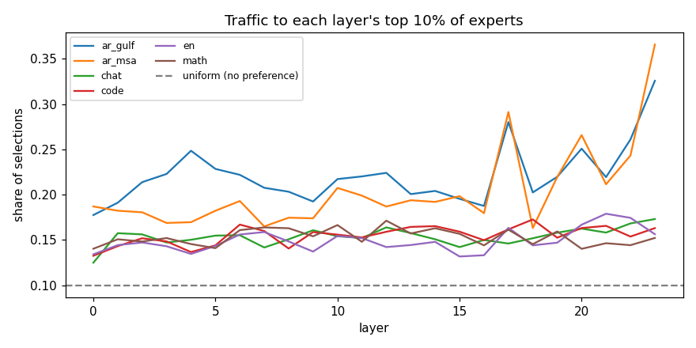
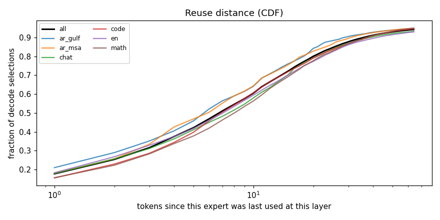
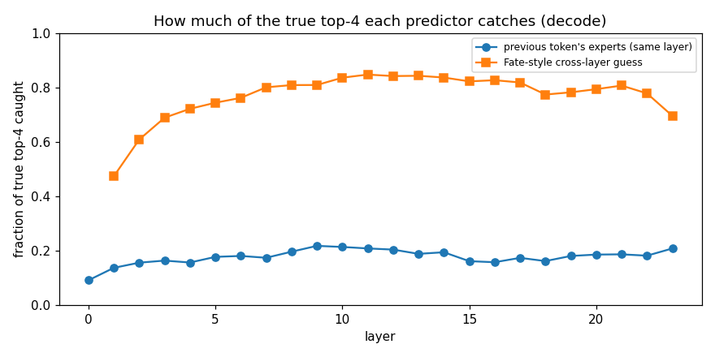
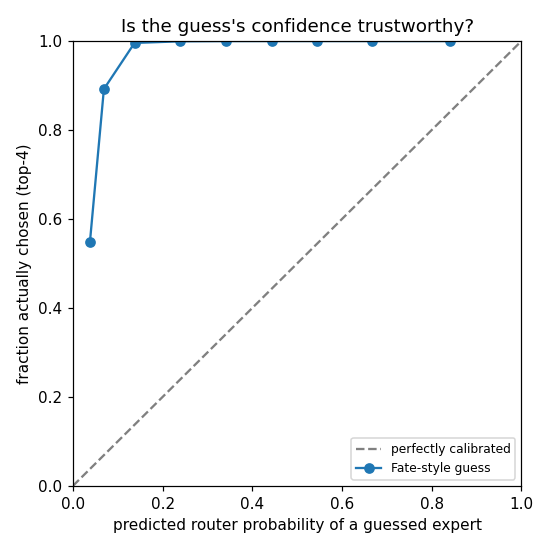
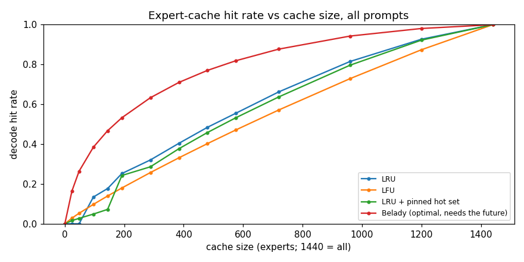
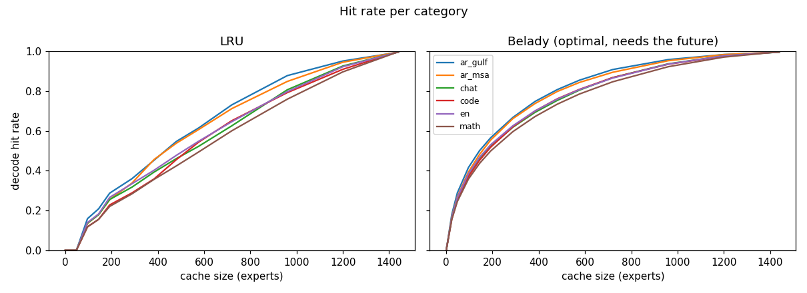
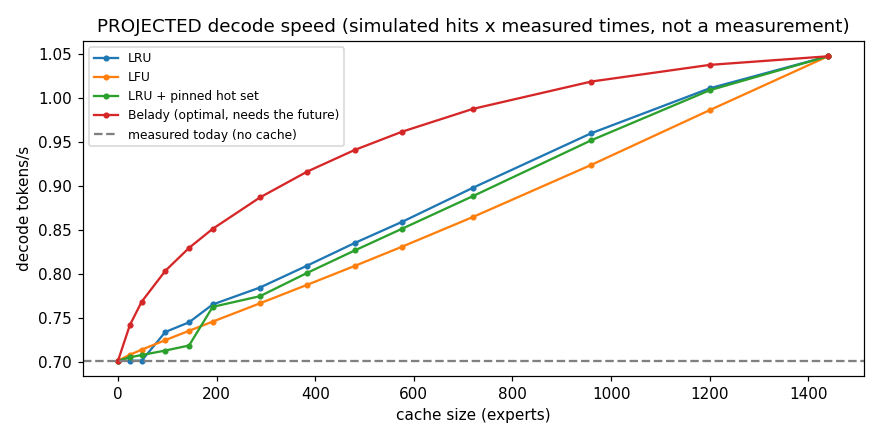
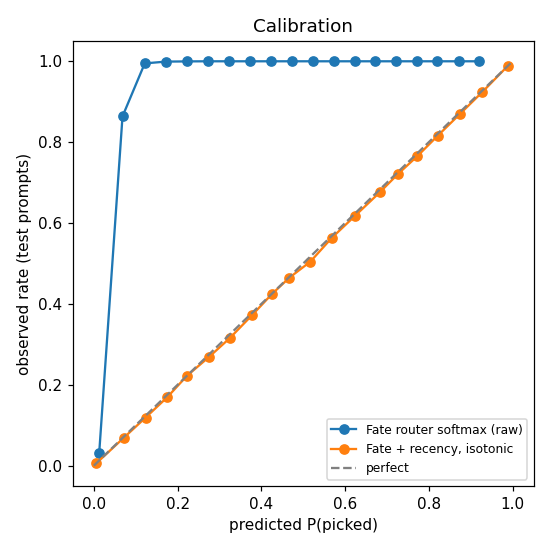
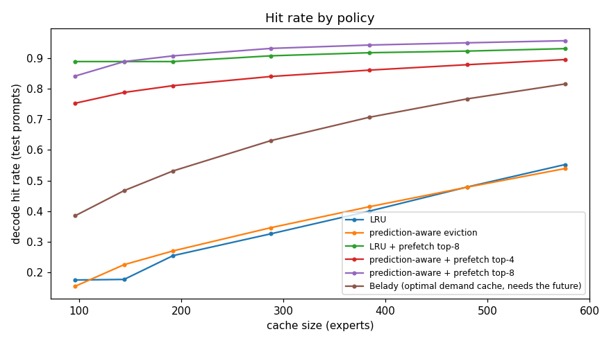

# Phase 3: how Qwen/Qwen1.5-MoE-A2.7B uses its experts

Generated by `python -m expertrelay.bench.phase3_analysis` at 2026-09-26T20:31:48Z (commit 1ca8f87) from `benchmarks/results/phase3_analysis_qwen1.5-moe-a2.7b-int8.json`, computed from the traces in `models/traces/qwen1.5-moe-a2.7b-int8`. Do not edit by hand.

Data: 96 prompts (ar_gulf: 16, ar_msa: 16, chat: 16, code: 16, en: 16, math: 16), 13869 tokens through the model, 12192 of them generated (greedy). Store revision `1a758c5`, prompt format `plain`.

## 1. Popularity

Each layer has 60 experts. Its top 10% (6) would get 10% of selections if routing were uniform. Measured share, averaged over layers:

| | all | prefill | decode |
|---|---|---|---|
| top 10% share | 13.9% | 19.9% | 13.9% |

| category | ar_gulf | ar_msa | chat | code | en | math |
|---|---|---|---|---|---|---|
| top 10% share | 22.1% | 20.4% | 15.4% | 15.5% | 14.9% | 15.3% |

## 2. Reuse distance

Tokens until the same expert is used again at the same layer (decode selections):

| | within 1 token | within 2 | within 8 | within 32 | first use in the sequence | median (reused) |
|---|---|---|---|---|---|---|
| all | 17.7% | 25.3% | 54.5% | 88.6% | 4.7% | 7.0 |
| ar_gulf | 21.0% | 28.9% | 59.0% | 91.1% | 4.4% | 6.0 |
| ar_msa | 18.0% | 25.6% | 59.0% | 90.5% | 4.3% | 6.0 |
| chat | 17.9% | 25.6% | 51.5% | 87.7% | 5.7% | 7.0 |
| code | 15.5% | 22.9% | 54.2% | 87.7% | 4.1% | 7.0 |
| en | 18.3% | 26.8% | 53.4% | 87.0% | 6.0% | 7.0 |
| math | 15.6% | 22.3% | 49.9% | 87.7% | 3.5% | 8.0 |

## 3. Temporal locality (same layer, previous token)

| | shares at least one expert | fraction of the 4 shared | all 4 the same |
|---|---|---|---|
| prefill | 48.1% | 17.5% | 0.4% |
| decode | 48.2% | 17.7% | 0.5% |
| ar_gulf | 55.5% | 20.6% | 0.4% |
| ar_msa | 49.7% | 18.0% | 0.4% |
| chat | 47.8% | 17.9% | 0.6% |
| code | 43.8% | 15.6% | 0.5% |
| en | 48.8% | 18.3% | 0.6% |
| math | 43.8% | 15.8% | 0.4% |

## 4. Predictability: the Fate-style cross-layer guess

Layer L+1's router applied to layer L's gate input (Fang et al., arXiv:2502.12224). Recall@4 = the fraction of the true top-4 that the guessed top-4 catches. The last column is the trivial alternative, guessing the previous token's experts at the same layer.

| | recall@4 | 0 of 4 | 1 | 2 | 3 | 4 of 4 | previous-token guess |
|---|---|---|---|---|---|---|---|
| all | 77.6% | 0.6% | 3.9% | 15.2% | 45.0% | 35.3% | 17.7% |
| prefill | 81.2% | 0.6% | 2.6% | 10.8% | 43.4% | 42.6% | 17.5% |
| decode | 77.1% | 0.6% | 4.1% | 15.8% | 45.2% | 34.3% | 17.7% |
| ar_gulf | 77.4% | 0.8% | 3.5% | 15.1% | 46.5% | 34.1% | 20.6% |
| ar_msa | 78.1% | 0.7% | 3.3% | 14.2% | 46.4% | 35.3% | 18.0% |
| chat | 80.4% | 0.2% | 2.5% | 12.7% | 44.3% | 40.2% | 17.9% |
| code | 73.3% | 1.1% | 6.2% | 19.7% | 44.5% | 28.4% | 15.6% |
| en | 80.9% | 0.3% | 2.6% | 11.8% | 43.4% | 41.8% | 18.3% |
| math | 75.9% | 0.8% | 5.0% | 17.1% | 44.4% | 32.8% | 15.8% |

**Is its confidence trustworthy?** For each guessed expert: its predicted router probability, and how often it was actually among the chosen 4.

| predicted probability | guesses | mean predicted | actually chosen |
|---|---|---|---|
| 0.00-0.05 | 522179 | 3.8% | 54.9% |
| 0.05-0.10 | 456174 | 6.9% | 89.2% |
| 0.10-0.20 | 220984 | 13.7% | 99.6% |
| 0.20-0.30 | 51241 | 23.9% | 99.9% |
| 0.30-0.40 | 14979 | 34.2% | 100.0% |
| 0.40-0.50 | 5612 | 44.3% | 100.0% |
| 0.50-0.60 | 2638 | 54.4% | 100.0% |
| 0.60-0.80 | 1989 | 66.7% | 100.0% |
| 0.80-1.00 | 152 | 84.2% | 100.0% |

Recall@4 by the guess's total confidence (sum of its 4 predicted probabilities), lowest to highest quartile: 61.5%, 77.0%, 83.9%, 88.0%.

## 5. Cache simulation

Replays what the runtime actually loads (1,248,511 expert loads, 96 per generated token), with the cache warm across prompts. Pinned policy: 50% of the cache holds a fixed hot set chosen from OTHER prompts (the other half of the run for 'all'; the other categories, per category). Decode hit rate:

| cache (experts) | RAM | LRU | LFU | LRU + pinned hot set | Belady (optimal, needs the future) |
|---|---|---|---|---|---|
| 0 | 0.00 GB | 0.0% | 0.0% | 0.0% | 0.0% |
| 48 | 0.42 GB | 0.0% | 5.3% | 2.8% | 26.4% |
| 96 | 0.83 GB | 13.4% | 9.7% | 4.9% | 38.4% |
| 192 | 1.66 GB | 25.2% | 18.0% | 24.2% | 53.2% |
| 384 | 3.33 GB | 40.4% | 33.1% | 37.7% | 70.9% |
| 720 | 6.24 GB | 66.2% | 57.1% | 63.7% | 87.6% |
| 1440 | 12.49 GB | 99.9% | 99.9% | 99.9% | 99.9% |

## 6. Projected decode speed: a projection, not a measurement

PROJECTION from simulated hit rates + Phase 2 measured times; not a measurement. Inputs measured in Phase 2: 0.95 s compute per token, 4.9 ms per expert read, 0.70 tok/s measured with no cache (benchmarks/results/phase2_baselines.json @ 5406ea5).

| cache (experts) | RAM | LRU | LFU | LRU + pinned hot set | Belady (optimal, needs the future) |
|---|---|---|---|---|---|
| 0 | 0.00 GB | 0.70 | 0.70 | 0.70 | 0.70 |
| 48 | 0.42 GB | 0.70 | 0.71 | 0.71 | 0.77 |
| 96 | 0.83 GB | 0.73 | 0.72 | 0.71 | 0.80 |
| 192 | 1.66 GB | 0.77 | 0.75 | 0.76 | 0.85 |
| 384 | 3.33 GB | 0.81 | 0.79 | 0.80 | 0.92 |
| 720 | 6.24 GB | 0.90 | 0.86 | 0.89 | 0.99 |
| 1440 | 12.49 GB | 1.05 | 1.05 | 1.05 | 1.05 |

Even a perfect cache can't beat compute: at a 100% hit rate the projection is 1.05 tok/s, because compute is the bottleneck (Phase 2).

<!-- appended sections: kept when this doc is regenerated -->

<!-- section:phase35 -->
## 7. Phase 3.5: better prediction and caching (simulation only)

Generated by `python -m expertrelay.bench.phase35_prediction` at 2026-09-26T19:30:15Z (commit 12e6e87) from `benchmarks/results/phase35_prediction_qwen1.5-moe-a2.7b-int8.json`. Do not edit by hand.

**Held out.** within each category: odd-numbered prompts tune, even-numbered prompts test: 48 tuning prompts, 48 test prompts. Every weight, calibration curve and "best" choice comes from the tuning prompts; every number below is from the test prompts (6096 generated tokens).

### Recall when guessing more experts

Share of the router's true 4 experts caught by the top-k guess, generated tokens, layers 1-23 (one layer ahead):

| predictor | k=4 | k=6 | k=8 | k=10 | k=12 |
|---|---|---|---|---|---|
| Fate-style (cross-layer gate) | 77.4% | 87.8% | 92.0% | 94.2% | 95.6% |
| Fate + recency (weight 0.0, decay 1.0) | 77.4% | 87.8% | 92.0% | 94.2% | 95.6% |
| recency only (last 8 tokens) | 14.7% | 20.2% | 25.2% | 29.6% | 33.9% |

Layer 0 has no layer before it, so its guess (made during the previous token's last layer) is popularity plus recency (weight 0.25, decay 1.0):

| layer 0 | k=4 | k=6 | k=8 | k=10 | k=12 |
|---|---|---|---|---|---|
| popularity only | 8.3% | 12.4% | 15.7% | 19.2% | 23.0% |
| popularity + recency | 9.2% | 13.3% | 17.1% | 21.1% | 24.9% |

### Two layers ahead

Fate's gate can't be applied two layers ahead from these traces: that needs the hidden state, which the traces don't record. So the drop is measured with expert-to-expert transition tables (learned on the tuning prompts), each plus tuned recency. Same targets for every row (layers 2-23):

| predictor | k=4 | k=6 | k=8 | k=10 | k=12 |
|---|---|---|---|---|---|
| 1 ahead: Fate + recency | 78.8% | 89.2% | 93.4% | 95.6% | 96.8% |
| 1 ahead: transitions from the previous layer's picks | 43.9% | 54.6% | 62.2% | 67.8% | 72.2% |
| 2 ahead: transitions from the picks two layers back | 42.0% | 52.2% | 59.6% | 65.3% | 69.8% |
| 2 ahead: Fate's guess for the next layer, then one transition step | 39.7% | 50.0% | 57.3% | 63.0% | 67.6% |

### Calibrated confidence

P(expert is among the 4 picked), over all 60 experts of every layer-1-23 visit (8,412,480 test pairs). ECE: 20 equal-width bins. Lower is better for both columns.

| probability | ECE | Brier |
|---|---|---|
| Fate router softmax, as is | 0.0500 | 0.0571 |
| Fate, isotonic-calibrated | 0.0006 | 0.0236 |
| Fate + recency, isotonic-calibrated | 0.0006 | 0.0236 |
| layer 0: popularity + recency, isotonic | 0.0007 | 0.0621 |

### Cache policies

Test prompts replayed back to back, cache warm across them, decode hit rate. "Prediction-aware" evicts the expert least likely to be picked at its layer's next visit (the calibrated prediction for the next layer; a reuse table, from the tuning prompts, for the others). "Prefetch top-k" loads the k most likely experts for the next layer one layer early. Gap closed = share of the LRU-to-Belady gap; above 100% is possible with prefetching, because Belady is only optimal among caches that load on demand.

| policy | 96 (0.83 GB) | 144 (1.25 GB) | 192 (1.66 GB) | 288 (2.50 GB) | 384 (3.33 GB) | 480 (4.16 GB) | 576 (4.99 GB) |
|---|---|---|---|---|---|---|---|
| LRU | 17.6% | 17.8% | 25.5% | 32.6% | 40.0% | 47.9% | 55.2% |
| LRU + prefetch top-4 | 74.6% (272.2%) | 78.2% (208.8%) | 78.5% (191.7%) | 80.8% (158.2%) | 83.0% (140.2%) | 84.9% (128.6%) | 86.8% (120.1%) |
| LRU + prefetch top-6 | 84.7% (320.2%) | 84.7% (230.9%) | 87.0% (222.7%) | 87.8% (181.3%) | 88.9% (159.6%) | 90.2% (146.9%) | 91.3% (137.0%) |
| LRU + prefetch top-8 | 88.8% (340.1%) | 88.8% (245.3%) | 88.8% (229.1%) | 90.7% (190.9%) | 91.7% (168.8%) | 92.2% (154.2%) | 93.1% (143.9%) |
| prediction-aware eviction | 15.5% (-9.8%) | 22.6% (16.6%) | 27.1% (5.6%) | 34.6% (6.6%) | 41.5% (4.7%) | 47.8% (-0.2%) | 53.9% (-5.0%) |
| prediction-aware + prefetch top-4 | 75.2% (275.2%) | 78.8% (210.6%) | 81.0% (200.7%) | 84.0% (168.8%) | 86.0% (150.3%) | 87.8% (138.8%) | 89.5% (130.3%) |
| prediction-aware + prefetch top-6 | 82.1% (308.1%) | 86.1% (236.0%) | 88.2% (226.9%) | 90.6% (190.5%) | 91.9% (169.5%) | 92.9% (156.6%) | 93.9% (147.0%) |
| prediction-aware + prefetch top-8 | 84.1% (317.5%) | 88.8% (245.3%) | 90.7% (235.8%) | 93.1% (198.9%) | 94.2% (177.0%) | 94.9% (163.6%) | 95.6% (153.7%) |
| Belady (optimal demand cache, needs the future) | 38.5% | 46.7% | 53.2% | 63.1% | 70.6% | 76.7% | 81.5% |

Reads per generated token (demand + prefetch), test prompts:

| policy | 96 | 144 | 192 | 288 | 384 | 480 | 576 |
|---|---|---|---|---|---|---|---|
| LRU | 79.1 + 0.0 | 79.0 + 0.0 | 71.5 + 0.0 | 64.7 + 0.0 | 57.6 + 0.0 | 50.0 + 0.0 | 43.0 + 0.0 |
| LRU + prefetch top-4 | 24.4 + 96.0 | 20.9 + 73.2 | 20.7 + 72.3 | 18.5 + 62.7 | 16.3 + 54.4 | 14.5 + 47.7 | 12.7 + 40.9 |
| LRU + prefetch top-6 | 14.7 + 144.0 | 14.7 + 143.8 | 12.4 + 105.7 | 11.7 + 95.8 | 10.7 + 85.3 | 9.5 + 73.7 | 8.4 + 63.8 |
| LRU + prefetch top-8 | 10.7 + 192.0 | 10.7 + 192.0 | 10.7 + 187.0 | 8.9 + 133.9 | 8.0 + 111.1 | 7.4 + 100.8 | 6.7 + 86.6 |
| prediction-aware eviction | 81.1 + 0.0 | 74.3 + 0.0 | 70.0 + 0.0 | 62.7 + 0.0 | 56.2 + 0.0 | 50.1 + 0.0 | 44.2 + 0.0 |
| prediction-aware + prefetch top-4 | 23.8 + 80.3 | 20.4 + 71.7 | 18.3 + 68.1 | 15.4 + 61.0 | 13.4 + 54.6 | 11.7 + 48.6 | 10.1 + 42.9 |
| prediction-aware + prefetch top-6 | 17.2 + 110.9 | 13.3 + 109.0 | 11.3 + 104.1 | 9.0 + 91.8 | 7.8 + 80.7 | 6.8 + 70.9 | 5.9 + 61.9 |
| prediction-aware + prefetch top-8 | 15.3 + 127.3 | 10.7 + 139.4 | 8.9 + 136.5 | 6.6 + 123.7 | 5.5 + 107.0 | 4.9 + 92.9 | 4.2 + 80.5 |
| Belady (optimal demand cache, needs the future) | 59.0 + 0.0 | 51.1 + 0.0 | 45.0 + 0.0 | 35.5 + 0.0 | 28.2 + 0.0 | 22.4 + 0.0 | 17.7 + 0.0 |

### Projected decode speed: a projection, not a measurement

PROJECTION from simulated reads + Phase 2 measured compute; not a measurement. Compute: 0.954 s per token (Phase 2), spread evenly over the layers (39.8 ms each). One read at a time; a prefetch for the next layer is hidden behind the current layer's compute, and any part that doesn't fit delays the next layer, as do demand misses. The whole layer's compute is assumed available to hide the prefetch; in the real forward pass the prediction is ready only after that layer's attention, so this is optimistic about the window. Two read times:

- **Phase 2 runtime**: 4.91 ms per expert, what the runtime achieved end to end (benchmarks/results/phase2_baselines.json @ 5406ea5).
- **raw SSD**: 2.08 ms per expert, the uncached random-read benchmark (benchmarks/results/machine_profile_THE-BEAST.json @ fb084d1); the runtime doesn't reach this today.

Measured today, no cache: 0.70 tok/s. Compute-only ceiling: 1.05 tok/s.

| policy | read time | 96 | 144 | 192 | 288 | 384 | 480 | 576 |
|---|---|---|---|---|---|---|---|---|
| LRU | phase2 runtime | 0.74 | 0.75 | 0.77 | 0.79 | 0.81 | 0.83 | 0.86 |
| LRU | raw ssd | 0.89 | 0.89 | 0.91 | 0.92 | 0.93 | 0.94 | 0.96 |
| LRU + prefetch top-4 | phase2 runtime | 0.93 | 0.95 | 0.95 | 0.96 | 0.97 | 0.98 | 0.98 |
| LRU + prefetch top-4 | raw ssd | 0.99 | 1.00 | 1.00 | 1.01 | 1.01 | 1.02 | 1.02 |
| LRU + prefetch top-6 | phase2 runtime | 0.97 | 0.97 | 0.98 | 0.99 | 0.99 | 1.00 | 1.00 |
| LRU + prefetch top-6 | raw ssd | 1.02 | 1.02 | 1.02 | 1.02 | 1.02 | 1.03 | 1.03 |
| LRU + prefetch top-8 | phase2 runtime | 0.99 | 0.99 | 0.99 | 1.00 | 1.01 | 1.01 | 1.01 |
| LRU + prefetch top-8 | raw ssd | 1.02 | 1.02 | 1.02 | 1.03 | 1.03 | 1.03 | 1.03 |
| prediction-aware eviction | phase2 runtime | 0.74 | 0.76 | 0.77 | 0.79 | 0.81 | 0.83 | 0.85 |
| prediction-aware eviction | raw ssd | 0.89 | 0.90 | 0.91 | 0.92 | 0.93 | 0.94 | 0.96 |
| prediction-aware + prefetch top-4 | phase2 runtime | 0.93 | 0.95 | 0.96 | 0.97 | 0.98 | 0.99 | 1.00 |
| prediction-aware + prefetch top-4 | raw ssd | 1.00 | 1.00 | 1.01 | 1.01 | 1.02 | 1.02 | 1.03 |
| prediction-aware + prefetch top-6 | phase2 runtime | 0.96 | 0.98 | 0.99 | 1.00 | 1.01 | 1.01 | 1.02 |
| prediction-aware + prefetch top-6 | raw ssd | 1.01 | 1.02 | 1.02 | 1.03 | 1.03 | 1.03 | 1.03 |
| prediction-aware + prefetch top-8 | phase2 runtime | 0.97 | 0.99 | 1.00 | 1.01 | 1.02 | 1.02 | 1.03 |
| prediction-aware + prefetch top-8 | raw ssd | 1.01 | 1.02 | 1.03 | 1.03 | 1.04 | 1.04 | 1.04 |
| Belady (optimal demand cache, needs the future) | phase2 runtime | 0.80 | 0.83 | 0.85 | 0.89 | 0.92 | 0.94 | 0.96 |
| Belady (optimal demand cache, needs the future) | raw ssd | 0.93 | 0.94 | 0.95 | 0.97 | 0.99 | 1.00 | 1.01 |

Belady here has no prefetch, so its reads aren't overlapped.

**Best combination per cache size** (chosen by projected tok/s on the TUNING prompts, shown on the test prompts):

| read time | cache | chosen | hit rate | reads/token (demand + prefetch) | projected tok/s |
|---|---|---|---|---|---|
| phase2 runtime | 96 (0.83 GB) | LRU + prefetch top-8 | 88.8% | 10.7 + 192.0 | 0.99 |
| phase2 runtime | 144 (1.25 GB) | prediction-aware + prefetch top-8 | 88.8% | 10.7 + 139.4 | 0.99 |
| phase2 runtime | 192 (1.66 GB) | prediction-aware + prefetch top-8 | 90.7% | 8.9 + 136.5 | 1.00 |
| phase2 runtime | 288 (2.50 GB) | prediction-aware + prefetch top-8 | 93.1% | 6.6 + 123.7 | 1.01 |
| phase2 runtime | 384 (3.33 GB) | prediction-aware + prefetch top-8 | 94.2% | 5.5 + 107.0 | 1.02 |
| phase2 runtime | 480 (4.16 GB) | prediction-aware + prefetch top-8 | 94.9% | 4.9 + 92.9 | 1.02 |
| phase2 runtime | 576 (4.99 GB) | prediction-aware + prefetch top-8 | 95.6% | 4.2 + 80.5 | 1.03 |
| raw ssd | 96 (0.83 GB) | LRU + prefetch top-8 | 88.8% | 10.7 + 192.0 | 1.02 |
| raw ssd | 144 (1.25 GB) | prediction-aware + prefetch top-8 | 88.8% | 10.7 + 139.4 | 1.02 |
| raw ssd | 192 (1.66 GB) | prediction-aware + prefetch top-8 | 90.7% | 8.9 + 136.5 | 1.03 |
| raw ssd | 288 (2.50 GB) | prediction-aware + prefetch top-8 | 93.1% | 6.6 + 123.7 | 1.03 |
| raw ssd | 384 (3.33 GB) | prediction-aware + prefetch top-8 | 94.2% | 5.5 + 107.0 | 1.04 |
| raw ssd | 480 (4.16 GB) | prediction-aware + prefetch top-8 | 94.9% | 4.9 + 92.9 | 1.04 |
| raw ssd | 576 (4.99 GB) | prediction-aware + prefetch top-8 | 95.6% | 4.2 + 80.5 | 1.04 |
<!-- /section:phase35 -->

<!-- section:phase4_offline -->
## 8. Phase 4 offline check: pinning layer 0

Generated by `python -m expertrelay.bench.phase4_offline` at 2026-09-26T20:26:07Z (commit b185393) from `benchmarks/results/phase4_offline_qwen1.5-moe-a2.7b-int8.json`. Do not edit by hand.

The runtime's policy, simulated on the 48 test prompts (6096 generated tokens): LRU; prefetch the top-8 Fate-guessed experts for layers 1-23 one layer ahead, skipping guesses below a calibrated probability of 0.05; no guess for layer 0. Pinning all 60 layer-0 experts takes 0.52 GB OF the cache size shown, not on top of it.

Decode hit rate (layer 0's own hit rate in brackets):

| policy | 144 (1.25 GB) | 192 (1.66 GB) | 288 (2.50 GB) | 384 (3.33 GB) | 480 (4.16 GB) | 576 (4.99 GB) |
|---|---|---|---|---|---|---|
| LRU, no prefetch | 17.8% (9.5%) | 25.5% (15.1%) | 32.6% (21.9%) | 40.0% (30.0%) | 47.9% (39.2%) | 55.2% (47.8%) |
| LRU, no prefetch, layer 0 pinned | 4.2% (100.0%) | 21.5% (100.0%) | 30.5% (100.0%) | 40.1% (100.0%) | 47.2% (100.0%) | 55.1% (100.0%) |
| LRU + prefetch top-8 | 86.8% (0.0%) | 88.4% (8.1%) | 89.1% (10.2%) | 90.2% (15.7%) | 91.1% (21.3%) | 92.0% (26.9%) |
| LRU + prefetch top-8, layer 0 pinned | 91.0% (100.0%) | 91.0% (100.0%) | 92.7% (100.0%) | 93.2% (100.0%) | 93.9% (100.0%) | 94.7% (100.0%) |
| Belady (optimal demand cache, needs the future) | 46.7% | 53.2% | 63.1% | 70.6% | 76.7% | 81.5% |

Reads per generated token (demand + prefetch):

| policy | 144 | 192 | 288 | 384 | 480 | 576 |
|---|---|---|---|---|---|---|
| LRU, no prefetch | 79.0 + 0.0 | 71.5 + 0.0 | 64.7 + 0.0 | 57.6 + 0.0 | 50.0 + 0.0 | 43.0 + 0.0 |
| LRU, no prefetch, layer 0 pinned | 92.0 + 0.0 | 75.4 + 0.0 | 66.7 + 0.0 | 57.5 + 0.0 | 50.7 + 0.0 | 43.1 + 0.0 |
| LRU + prefetch top-8 | 12.6 + 169.1 | 11.2 + 129.2 | 10.5 + 122.6 | 9.4 + 103.5 | 8.5 + 89.4 | 7.7 + 77.8 |
| LRU + prefetch top-8, layer 0 pinned | 8.6 + 169.2 | 8.6 + 169.2 | 7.0 + 124.9 | 6.5 + 112.4 | 5.8 + 98.8 | 5.1 + 84.1 |
| Belady (optimal demand cache, needs the future) | 51.1 + 0.0 | 45.0 + 0.0 | 35.5 + 0.0 | 28.2 + 0.0 | 22.4 + 0.0 | 17.7 + 0.0 |

**Projected decode tok/s: a projection, not a measurement.** PROJECTION from simulated reads + Phase 2 measured compute; not a measurement; same model as section 7 (compute spread evenly over layers, one read at a time, a prefetch hidden behind the previous layer's whole compute, which is optimistic). Read times: phase2 runtime 4.91 ms (benchmarks/results/phase2_baselines.json @ 5406ea5), raw ssd 2.08 ms (benchmarks/results/machine_profile_THE-BEAST.json @ fb084d1).

| policy | read time | 144 | 192 | 288 | 384 | 480 | 576 |
|---|---|---|---|---|---|---|---|
| LRU, no prefetch | phase2 runtime | 0.75 | 0.77 | 0.79 | 0.81 | 0.83 | 0.86 |
| LRU, no prefetch | raw ssd | 0.89 | 0.91 | 0.92 | 0.93 | 0.94 | 0.96 |
| LRU, no prefetch, layer 0 pinned | phase2 runtime | 0.71 | 0.76 | 0.78 | 0.81 | 0.83 | 0.86 |
| LRU, no prefetch, layer 0 pinned | raw ssd | 0.87 | 0.90 | 0.91 | 0.93 | 0.94 | 0.96 |
| LRU + prefetch top-8 | phase2 runtime | 0.98 | 0.99 | 0.99 | 1.00 | 1.00 | 1.01 |
| LRU + prefetch top-8 | raw ssd | 1.02 | 1.02 | 1.02 | 1.03 | 1.03 | 1.03 |
| LRU + prefetch top-8, layer 0 pinned | phase2 runtime | 1.00 | 1.00 | 1.01 | 1.01 | 1.02 | 1.02 |
| LRU + prefetch top-8, layer 0 pinned | raw ssd | 1.03 | 1.03 | 1.03 | 1.03 | 1.03 | 1.04 |
| Belady (optimal demand cache, needs the future) | phase2 runtime | 0.83 | 0.85 | 0.89 | 0.92 | 0.94 | 0.96 |
| Belady (optimal demand cache, needs the future) | raw ssd | 0.94 | 0.95 | 0.97 | 0.99 | 1.00 | 1.01 |
<!-- /section:phase4_offline -->

